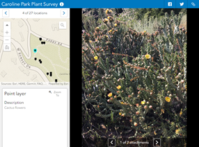

# Attachment Viewer

Attachment Viewer is a configurable app template that allows you to view photos, videos, and PDFs stored as feature attachments.

## 7.3 Release Updates

1. Map layout
2. Multiple layer support
3. PDF support
4. Image pan/zoom tool using [iv-viewer](https://github.com/s-yadav/iv-viewer)
5. Only display features with attachments only
6. Display image direction camera icon (GPS Image direction)

## Features

1. Attachment focused layout: Scroll through features to view feature information and attachments or simply click on a feature in the map.

2. Map foucsed layout: Explore map to update gallery items in side panel. Gallery items in side panel will be based on features within map extent. Select gallery item to view feature's attachments and pop-up information.

   a. Title tooltip option is available which will display at the feature's location when a gallery item in the side panel is hovered or selected. The title used in the tooltip label can be configured in the map viewer.

3. If the webmap contains multiple layers that support attachments, the end-user has the ability to select which layers' attachments to view from a dropdown menu.

4. Scroll through attachments from a single feature.

5. Supported attachment types:

   a. images(jpeg, jpg, png, gif)
   b. videos (mp4, mov)
   c. pdf

   Please note: Other attachment types such as `doc` will display in the feature content panel as hyperlinks.

6. Feauture Content - Panel which provides information about the feature. The content displays pop-up information by default and can display custom information by configuring the pop-up in the web map.

7. Social Sharing - Share to Facebook, Twitter, or generate a share link. The app will be shared at the app's currently selected feature and viewed attachment.

8. Download images

9. Onboarding panel to communicate explanatory information to the end-user.

Configuration options:

#### General

1. Specify app layout

2. Sort features by field and set the order in ascending or descending order.

3. Provide a custom title.

4. Onboarding

   a. Content - Provide custom onboarding information to help end-users get a better understanding of what the app is about.
   b. Image - Provide an image URL to display an image when the onboarding panel is open.

5. Modify the header background and header text colors.

6. Add custom CSS

#### Options

1. Select from a set of map tools:

   a. Home
   b. Zoom Controls
   c. Legend
   d. Layer List
   e. Full Screen
   f. Search - configure search to work with a feature layer and field in the web map, as search results will pull up feature information and attachments

2. Set the scale for the Zoom to button. Default value: 32000
3. Toggle social sharing
4. Toggle image downloads
5. Toggle the option to display the selected feature's address.
6. Toggle feature selection
7. Toggle image direction icon
8. Toggle image pan/zoom
9. Toggle feature label (title tooltip in map)
10. Toggle the option to only display features with attachments

## Instructions

1. Fork and then clone the repo.
2. Run `npm install`
3. Host on local web server.
4. Open web browser.
5. Click on dist directory within browser tab.
6. Test with different web maps with feature layers that support and contain attachments.

## Requirements

- Notepad or your favorite HTML editor
- Web browser with access to the Internet

## Resources

- [ArcGIS for JavaScript API Resource Center](http://help.arcgis.com/en/webapi/javascript/arcgis/index.html)
- [ArcGIS Blog](http://blogs.esri.com/esri/arcgis/)
- [twitter@esri](http://twitter.com/esri)

## Issues

Find a bug or want to request a new feature? Please let us know by submitting an issue.

## Contributing

Esri welcomes contributions from anyone and everyone. Please see our [guidelines for contributing](https://github.com/esri/contributing).

## Licensing

Copyright 2019 Esri

Licensed under the Apache License, Version 2.0 (the "License");
you may not use this file except in compliance with the License.
You may obtain a copy of the License at

http://www.apache.org/licenses/LICENSE-2.0

Unless required by applicable law or agreed to in writing, software
distributed under the License is distributed on an "AS IS" BASIS,
WITHOUT WARRANTIES OR CONDITIONS OF ANY KIND, either express or implied.
See the License for the specific language governing permissions and
limitations under the License.

A copy of the license is available in the repository's [license.txt](License.txt) file.
